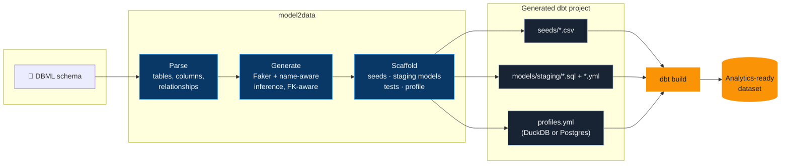

# model2data

[](https://pypi.org/project/model2data/)
[](https://github.com/JB-Analytica/model2data/actions/workflows/ci.yml)
[](https://codecov.io/gh/JB-Analytica/model2data)
[](LICENSE)

Built and maintained by [JB Analytica](https://www.jbanalytica.com/) — data platform architecture and analytics engineering.

**Turn a data model into a running analytics stack in one command.**

Give `model2data` a [DBML](https://dbml.dbdiagram.io/docs/) schema — hand-written or exported
from an existing database — and it generates realistic, relationship-preserving synthetic data
*and* a complete, runnable dbt project around it: seeds, staging models, tests, and a
DuckDB or Postgres profile. No sample data to hunt down, no dbt boilerplate to hand-write, no
production data to risk exposing.

A working analytics stack — real (synthetic) data, tested dbt models, queryable in
DuckDB — from a schema file, in seconds:


```bash
pip install model2data
model2data --file examples/ecommerce.dbml --rows 200 --seed 42
cd dbt_ecommerce && dbt build
```

---

## Why this exists

Analytics engineers hit the same wall constantly: you need realistic data to build or test a
pipeline, but production data is off-limits (privacy, access, scale), and hand-rolling mock CSVs
is tedious and doesn't scale past two tables. `model2data` closes that gap — from a schema
definition to a seeded, tested dbt project you can actually run, with no database or production
access required.

- **Privacy-safe.** Nothing but a schema definition goes in; nothing but synthetic data comes out.
- **Realistic, not random.** Column names are matched against ~35 common patterns — `email`,
  `first_name`, `city`, `phone`, `company`, ... — so a column called `email` gets real-looking
  emails, not `Lorem ipsum` text. Type a column with any Faker provider (`billing_country state`,
  `sku ean13`) to pick its generator outright when the name is wrong for the data.
- **Relationship-preserving.** Foreign keys resolve to real parent rows; tables are generated in
  dependency order.
- **Deterministic.** Pass `--seed` and the same schema always produces the same data — safe to
  commit fixtures, safe to diff across CI runs. Add `--as-of` to pin the date the data is anchored
  on, and the run reproduces on any later day rather than only on the day it first ran.
- **Re-rollable one table at a time.** `--table-seed orders=7` regenerates a single table and
  leaves every other table byte-identical, so you can keep the four tables that look right.
- **A real dbt project, not just CSVs.** Seeds, staging models that `ref()` them, schema tests,
  and a ready-to-use profile — the thing you'd otherwise spend an afternoon scaffolding by hand.
  A single `dbt build` loads, transforms, and tests the whole thing.

## Who is model2data for?

- **Analytics engineers** — generate realistic datasets and a working dbt project without
  waiting on production access.
- **Data engineers** — produce deterministic test data from an existing schema for pipeline and
  migration testing.
- **Software & data teams** — prototype integrations and analytics workflows without exposing
  production data.
- **Consultants & architects** — spin up realistic environments for demos, workshops, and
  architecture validation in minutes, not hours.

## How it works



1. **Parse.** Reads tables, columns, types, and `Ref` relationships from a DBML file.
2. **Generate.** Produces synthetic values per column — typed generation for known SQL types
   (int, date, timestamp, ...), then a Faker provider named as the type (`sku ean13`), then
   name-aware inference for everything else (`email`, `phone`, `city`, ...), foreign keys
   resolved against already-generated parent rows.
3. **Scaffold.** Writes a complete dbt project around that data: CSV seeds, staging models that
   `ref()` those seeds, `not_null`/`unique`/`relationships` tests, `accepted_values` tests for
   DBML `Enum`-typed columns, singular SQL tests for composite primary/unique keys, table and
   column `description:` fields pulled from DBML notes, and a profile for DuckDB (zero-config,
   file-based) or Postgres.

---

## Installation

```bash
pip install model2data
```

---

## Quick start

We bundle several example schemas in `examples/` — this walkthrough uses the e-commerce one
(`examples/ecommerce.dbml`: customers, products, orders, order items, and reviews).

Generate a project with synthetic data:

```bash
model2data --file examples/ecommerce.dbml --rows 200 --seed 42
```

This creates a `dbt_ecommerce/` folder with your data and dbt setup.

Real schemas are rarely uniform. `--rows-for` sizes individual tables, so a handful of customers
can sit behind a large orders table the way they would in the warehouse you're modelling:

```bash
model2data --file examples/ecommerce.dbml --rows 200 --seed 42 \
  --rows-for customers=50 --rows-for order_items=5000
```

`--seed` reproduces a run's numbers, but dates and timestamps are generated relative to the
current date, so the same seed drifts once the day turns over. `--as-of` pins the date they're
anchored on, and the whole dataset reproduces on any later day — which is what makes a generated
fixture safe to commit:

```bash
model2data --file examples/ecommerce.dbml --rows 200 --seed 42 --as-of 2026-01-31
```

If one table comes out wrong and the rest looks right, `--table-seed` re-rolls just that table.
Every other table's seed CSV stays byte-identical, and children of the re-rolled table still
reference rows that exist, so there's nothing to re-check but the table you asked to change:

```bash
model2data --file examples/ecommerce.dbml --rows 200 --seed 42 --table-seed orders=7
```

`--locale` picks the country every generated person and address comes from (`en_US` by default);
it's a per-run setting, so a table can't end up holding one Belgian and one American address. A
`country` column that sits beside a `city`/`street`/`state`/`postcode` column always agrees with
that place; a `country` column with none of those beside it isn't describing anyone's address, so
it reads as an international mix instead, with the locale's own country the most common:

```bash
model2data --file examples/ecommerce.dbml --rows 200 --seed 42 --locale nl_BE
```

### Shape when things happen

By default, every date and timestamp is drawn uniformly across its window. `--business-hours`,
`--growth`, and `--seasonality` shape that instead — weekdays and working hours, a trend across
the window, and an annual cycle peaking in Q4:

```bash
model2data --file examples/ecommerce.dbml --rows 200 --seed 42 \
  --business-hours --growth 0.5 --seasonality 0.3
```

Within a row, created/updated/deleted-style columns are ordered automatically — `updated_at` never
lands before its own `created_at` — under any profile, uniform included. A column whose name
doesn't say what it depends on can say so explicitly with an `after` note:

```dbml
shipped_at timestamp [note: '{"after": "ordered_at"}']
```

The flags above shape every date and timestamp column the same way, run-wide. `business_hours`,
`growth`, and `seasonality` column note hints override that for one column at a time — the whole
point being a run can be uniform everywhere except the one column that needs shaping, or shaped
everywhere except the one column that shouldn't be:

```dbml
Table orders {
  id int [pk]
  created_at timestamp [note: '{"business_hours": true, "growth": 0.4}']
  refunded_at timestamp [note: '{"growth": 0}']
}
```

Here `created_at` gets business hours and growth even on an otherwise-uniform run, while
`refunded_at` stays flat even under `--growth 0.5` — each hint only replaces the fields it names,
so a partial hint like `{"growth": 0}` leaves that column's `business_hours`/`seasonality` at
whatever the run-level flags set.

### Shape how the data is spread

By default every parent row is equally likely to be picked for a child row, and every column
gets the same generic null rate, value spread, and true/false split. `--skew` changes the first
part: `0.0` is that uniform default, `1.0` means a handful of parents hold most of the children —
"a fifth of the customers place most of the orders":

```bash
model2data --file examples/ecommerce.dbml --rows 200 --seed 42 --skew 0.8
```

Column note hints shape the rest, per column:

```dbml
Table orders {
  id int [pk]
  customer_id int [ref: > customers.id, note: '{"skew": 0.9}']
  status order_status [note: '{"weights": {"delivered": 20, "cancelled": 2}}']
  is_paid boolean [note: '{"true_rate": 0.9}']
  discount_code varchar [note: '{"null_rate": 0.8}']
  shipping_city varchar [note: '{"distinct": 12}']
}
```

`skew` on a foreign key overrides `--skew` for just that column. `weights` biases an enum column
toward the values named (unnamed values still appear, at weight 1). `true_rate` is the fraction of
non-null rows a boolean column comes back `true`. `null_rate` replaces the column's default null
fraction outright. `distinct` draws the column's values from a fixed-size pool instead of a fresh
value per row — a `shipping_city` most warehouses only ever see a handful of.

### Shape a number's distribution

`min`/`max` alone only ever drew uniformly between them. A `distribution` note hint on an
integer or decimal column picks a different shape instead:

```dbml
Table orders {
  id int [pk]
  total_amount numeric [note: '{"distribution": "lognormal", "median": 80, "spread": 0.6, "min": 5}']
}
```

`normal` takes `mean` (the centre) and `stddev` (the spread); `lognormal` takes `median` (the
typical value) and `spread` (how heavy the tail is — 0.3 is mild, 1.0 is heavy); `exponential`
takes `mean` (the average). Any left unset default to the midpoint of the column's effective
`min`/`max` (or `stddev` = range / 6, `spread` = 0.5). `min`/`max` still clip the result — a
`normal` centred near an edge redraws a bounded number of times before clamping, so it never
loops forever and never crosses the bound. Leaving `distribution` out, or setting it to
`"uniform"`, is exactly today's behaviour.

Run dbt to load, transform, and test the data:

```bash
cd dbt_ecommerce
dbt build
```

Staging models `ref()` their seeds, so a single `dbt build` loads the seeds, builds the models,
and runs every generated test in one dependency-ordered pass — no separate `dbt seed`/`dbt run`
needed, even on a brand-new database. (The individual `dbt deps`, `dbt seed`, and `dbt run`
commands still work if you'd rather drive the steps yourself; the generated project declares no
packages, so `dbt deps` is a no-op.)

Your analytics-ready dataset is now in DuckDB!

To target Postgres instead, install the extra and pass `--adapter postgres`:

```bash
pip install "model2data[postgres]"
model2data --file examples/ecommerce.dbml --rows 200 --seed 42 --adapter postgres
```

Connection details are read from environment variables (`MODEL2DATA_PG_HOST`, `MODEL2DATA_PG_PORT`, `MODEL2DATA_PG_USER`, `MODEL2DATA_PG_PASSWORD`, `MODEL2DATA_PG_DATABASE`), defaulting to `localhost:5432` with a `postgres`/`postgres` user for local development.

After generation, the CLI prints a short summary — tables and rows generated, relationships found in the DBML, and any columns that fell back to generic placeholder text because neither their type nor name could be matched.

Pass `--unit-tests` to also generate deterministic dbt unit test fixtures (`models/staging/ut_stg_<table>.yml`) from the actually-generated seed rows:

```bash
model2data --file examples/ecommerce.dbml --rows 200 --seed 42 --unit-tests
```

This targets dbt-core's native unit testing feature, which works out of the box with the base
install — see [dbt-core versions](#dbt-core-versions) below.

---

## Generated dbt project structure

The generated dbt project includes:

```
dbt_{project_name}/
├── seeds/
│   └── raw/
│       ├── __seed_config.yml  # seed descriptions + column-type overrides
│       ├── table1.csv
│       └── table2.csv
├── models/
│   └── staging/
│       ├── stg_table1.sql
│       ├── stg_table1.yml
│       ├── ut_stg_table1.yml  # only with --unit-tests
│       └── ...
├── data-tests/
│   └── unique_combination_stg_table1_col_a_col_b.sql  # only for composite pk/unique keys
├── macros/
│   └── generate_schema_name.sql
├── dbt_project.yml
├── profiles.yml  # DuckDB or Postgres config, depending on --adapter
└── {project_name}_profile.duckdb  # DuckDB adapter only
```

- **Seeds**: CSV files with generated synthetic data, plus `__seed_config.yml` — each seed's
  `description:` (from the table's DBML `Note`) and the column-type overrides that keep
  all-digit text columns (barcodes, zero-padded postcodes, ...) from being loaded as integers.
- **Staging Models**: Basic dbt models that `ref()` their seed. Using `ref()` rather than
  declaring the seeds as dbt `sources` is what gives each model a real DAG edge to the seed
  behind it, so one `dbt build` orders seeds before models on a fresh database.
- **Tests**: A YAML per staging model with column tests (`not_null`, `unique`, `relationships`,
  and `accepted_values` for DBML `Enum`-typed columns). Column `Note` text from the DBML becomes
  `description:` fields.
- **Composite key tests**: Composite primary/unique keys declared in an `indexes { }` block get
  a singular SQL test under `data-tests/`, dbt's configured `test-paths`.
- **Profiles**: Pre-configured for DuckDB (file-based) or Postgres (via env vars), with schema handling.
- **Unit tests** (opt-in via `--unit-tests`): `models/staging/ut_stg_<table>.yml` fixtures built
  from real generated rows, co-located with each staging model so dbt (which only parses unit
  tests from `model-paths`) picks them up.

---

## Using model2data with an LLM

If you want to go from a plain-English description of a data model straight to a running,
demo-ready dbt project, [LLMS.md](LLMS.md) is written for an LLM/agent to read: it covers the
full DBML feature set model2data understands (enums, notes, defaults, composite keys, both
relationship syntaxes, self-references) and the exact command sequence to run. Point an
LLM-backed coding assistant at it and describe your data model — it can author the DBML and run
model2data for you.

---

## dbt-core versions

model2data requires **dbt-core >= 1.11**, tracking [dbt's own version support
policy](https://docs.getdbt.com/docs/dbt-versions): dbt Labs supports each minor release for one
year, and 1.11 is the oldest that still is. Generated projects build cleanly — no deprecation
warnings — on every supported dbt-core version, and CI proves it on each push by running a real
`dbt build` against both the stated floor and the newest release.

If you're pinned to an older dbt-core, use model2data 0.5.x, which supported down to 1.8.5.

---

## Design decisions / non-goals

- **DuckDB Default**: Chosen for its zero-config, file-based nature, making it easy to get started without database setup. Postgres is supported via `--adapter postgres`; other adapters can be configured manually.
- **dbt Integration**: Leverages dbt's transformation capabilities for a familiar workflow in analytics engineering.
- **Synthetic Data**: Uses deterministic generation for reproducibility; not intended for production use or as a replacement for real data.
- **Non-goals**: This is not a data migration tool, ETL pipeline, or real-time data generator. It focuses on static, synthetic datasets for testing and prototyping.

---

## Limitations

- Synthetic data generation is heuristic-based (typed generation, name-aware inference, enum/default awareness) and may not perfectly mimic real-world distributions or edge cases.
- DuckDB and Postgres are supported today; other databases require manual profile adjustments.
- No support for incremental models or advanced dbt features in generated projects.
- Composite foreign keys (across a bridge/join table) are generated as independent single-column FKs — each column's values are individually valid, but the *combination* isn't guaranteed to match a real parent composite key unless that key is separately enforced via `indexes { }`.
- Any DBML the parser can't fully make sense of (a malformed line, a ref pointing at an unknown table, an unrecognized column definition) is reported as a warning in the CLI's summary rather than silently dropped — check that summary after generating from a schema you didn't author yourself.

---

## Project status

As of `1.0.0`, model2data is stable and feature-complete for its intended use case: turning a
DBML schema into realistic synthetic data and a runnable dbt project, reliably. It is actively
maintained — CI runs a real `dbt build` against both the oldest supported dbt-core and the newest
release on every push, so compatibility is proven rather than assumed. New capabilities are not
the focus; correctness, dbt-core compatibility and community contributions are.

Ideas that came up during development but were deliberately left out of scope, in case anyone
wants to pick them up as a contribution:

- Additional database adapters (e.g. Snowflake, BigQuery).
- A rule-based semantic layer scaffold (`semantic_models.yml`/basic metrics) derived from the
  parsed schema shape.
- Example mart-layer models on top of staging (the generated `dbt_project.yml` carries a
  ready-to-uncomment `marts` schema/materialization config for this).

See [CONTRIBUTING.md](CONTRIBUTING.md) if you'd like to work on any of these.

---

## Contributing

We welcome contributions!

- Open issues for bugs or feature requests.
- Submit PRs to add new DBML examples, custom data generators, or improvements.
- Ensure all new features include tests if possible.

See [CONTRIBUTING.md](CONTRIBUTING.md) for detailed guidelines, and [DEVELOPMENT.md](DEVELOPMENT.md) for the local dev setup and release process.

## Code of Conduct

Please read our [Code of Conduct](CODE_OF_CONDUCT.md) to understand our community standards.

---

## License

MIT License. See LICENSE for details.

---

<p align="center">
  <a href="https://www.jbanalytica.com">
    
  </a>
  <br>
  Built and maintained by <a href="https://www.jbanalytica.com"><strong>JB Analytica</strong></a> —
  Data & Analytics Engineering · Data Platform Architecture · Modern BI.
</p>
