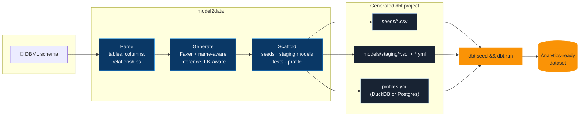
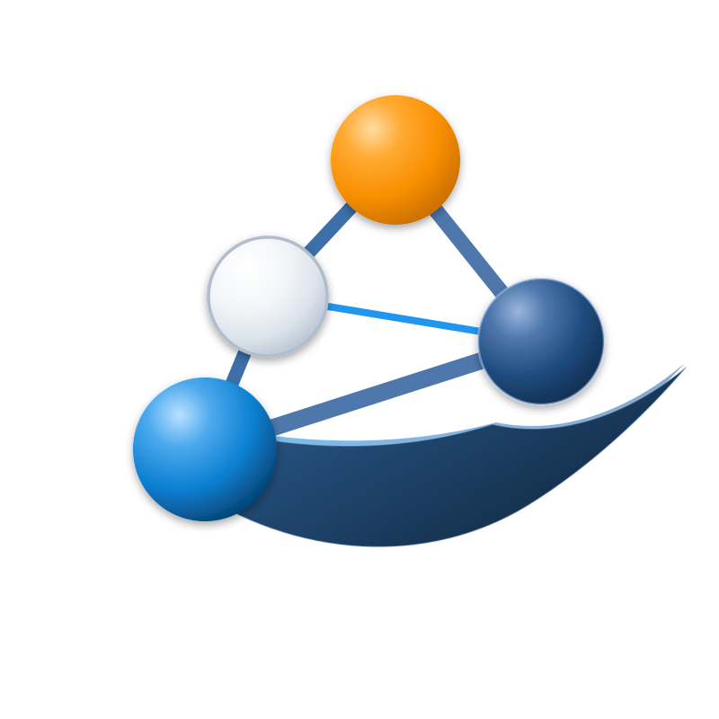

# model2data

[](https://pypi.org/project/model2data/)
[](https://github.com/JB-Analytica/model2data/actions/workflows/ci.yml)
[](https://codecov.io/gh/JB-Analytica/model2data)
[](LICENSE)

**Turn a data model into a running analytics stack in one command.**

Give `model2data` a [DBML](https://dbml.dbdiagram.io/docs/) schema — hand-written or exported
from an existing database — and it generates realistic, relationship-preserving synthetic data
*and* a complete, runnable dbt project around it: seeds, staging models, sources, tests, and a
DuckDB or Postgres profile. No sample data to hunt down, no dbt boilerplate to hand-write, no
production data to risk exposing.

```bash
pip install model2data
model2data --file examples/hackernews.dbml --rows 200 --seed 42
cd dbt_hackernews && dbt seed && dbt run
```

That's a working analytics stack — real (synthetic) data, tested dbt models, queryable in
DuckDB — from a schema file, in seconds:


---

## Why this exists

Analytics engineers hit the same wall constantly: you need realistic data to build or test a
pipeline, but production data is off-limits (privacy, access, scale), and hand-rolling mock CSVs
is tedious and doesn't scale past two tables. `model2data` closes that gap — from a schema
definition to a seeded, tested dbt project you can actually run, with no database or production
access required.

- **Privacy-safe.** Nothing but a schema definition goes in; nothing but synthetic data comes out.
- **Realistic, not random.** Column names are matched against ~35 common patterns — `email`,
  `first_name`, `city`, `phone`, `company`, ... — so a column called `email` gets real-looking
  emails, not `Lorem ipsum` text.
- **Relationship-preserving.** Foreign keys resolve to real parent rows; tables are generated in
  dependency order.
- **Deterministic.** Pass `--seed` and the same schema always produces the same data — safe to
  commit fixtures, safe to diff across CI runs.
- **A real dbt project, not just CSVs.** Seeds, staging models, sources, schema tests, and a
  ready-to-use profile — the thing you'd otherwise spend an afternoon scaffolding by hand.

## Who is model2data for?

- **Analytics engineers** — generate realistic datasets and a working dbt project without
  waiting on production access.
- **Data engineers** — produce deterministic test data from an existing schema for pipeline and
  migration testing.
- **Software & data teams** — prototype integrations and analytics workflows without exposing
  production data.
- **Consultants & architects** — spin up realistic environments for demos, workshops, and
  architecture validation in minutes, not hours.

## How it works



1. **Parse.** Reads tables, columns, types, and `Ref` relationships from a DBML file.
2. **Generate.** Produces synthetic values per column — typed generation for known SQL types
   (int, date, timestamp, ...), name-aware inference for everything else (`email`, `phone`,
   `city`, ...), foreign keys resolved against already-generated parent rows.
3. **Scaffold.** Writes a complete dbt project around that data: CSV seeds, staging models with
   `source`/`not_null`/`unique`/`relationships` tests, and a profile for DuckDB (zero-config,
   file-based) or Postgres.

---

## Installation

```bash
pip install model2data
```

---

## Quick start

We provide an example Hacker News dataset in `examples/hackernews.dbml`.

Generate a project with synthetic data:

```bash
model2data --file examples/hackernews.dbml --rows 200 --seed 42
```

This creates a `dbt_hackernews/` folder with your data and dbt setup.

Run dbt to load and transform the data:

```bash
cd dbt_hackernews
dbt deps
dbt seed
dbt run
```

Your analytics-ready dataset is now in DuckDB!

To target Postgres instead, install the extra and pass `--adapter postgres`:

```bash
pip install "model2data[postgres]"
model2data --file examples/hackernews.dbml --rows 200 --seed 42 --adapter postgres
```

Connection details are read from environment variables (`MODEL2DATA_PG_HOST`, `MODEL2DATA_PG_PORT`, `MODEL2DATA_PG_USER`, `MODEL2DATA_PG_PASSWORD`, `MODEL2DATA_PG_DATABASE`), defaulting to `localhost:5432` with a `postgres`/`postgres` user for local development.

After generation, the CLI prints a short summary — tables and rows generated, relationships found in the DBML, and any columns that fell back to generic placeholder text because neither their type nor name could be matched.

---

## Generated dbt project structure

The generated dbt project includes:

```
dbt_{project_name}/
├── seeds/
│   └── {project_name}/
│       ├── table1.csv
│       └── table2.csv
├── models/
│   └── {project_name}/
│       └── staging/
│           ├── __sources.yml
│           ├── stg_table1.sql
│           ├── stg_table1.yml
│           └── ...
├── macros/
│   └── generate_schema_name.sql
├── dbt_project.yml
├── profiles.yml  # DuckDB or Postgres config, depending on --adapter
└── {project_name}.duckdb  # DuckDB adapter only
```

- **Seeds**: CSV files with generated synthetic data.
- **Staging Models**: Basic dbt models that load from seeds.
- **Sources & Tests**: YAML configs defining sources and basic tests (not_null, unique).
- **Profiles**: Pre-configured for DuckDB (file-based) or Postgres (via env vars), with schema handling.

---

## Design decisions / non-goals

- **DuckDB Default**: Chosen for its zero-config, file-based nature, making it easy to get started without database setup. Postgres is supported via `--adapter postgres`; other adapters can be configured manually.
- **dbt Integration**: Leverages dbt's transformation capabilities for a familiar workflow in analytics engineering.
- **Synthetic Data**: Uses deterministic generation for reproducibility; not intended for production use or as a replacement for real data.
- **Non-goals**: This is not a data migration tool, ETL pipeline, or real-time data generator. It focuses on static, synthetic datasets for testing and prototyping.

---

## Limitations

- Supports basic DBML features; complex constraints or advanced SQL types may not be fully handled.
- Synthetic data generation is heuristic-based and may not perfectly mimic real-world distributions or edge cases.
- DuckDB and Postgres are supported today; other databases require manual profile adjustments.
- No support for incremental models or advanced dbt features in generated projects.

---

## Roadmap

- [x] Postgres adapter support (`--adapter postgres`)
- [x] Name-aware synthetic data (email, name, address, phone, etc. instead of generic text)
- [x] Post-run generation summary (tables, rows, relationships, unmapped columns)
- [ ] Additional database adapters (e.g., Snowflake, BigQuery).
- [ ] Enhanced data type handling and custom generators.
- [ ] Improved schema exploration and developer tooling.

---

## Contributing

We welcome contributions!

- Open issues for bugs or feature requests.
- Submit PRs to add new DBML examples, custom data generators, or improvements.
- Ensure all new features include tests if possible.

See [CONTRIBUTING.md](CONTRIBUTING.md) for detailed guidelines, and [DEVELOPMENT.md](DEVELOPMENT.md) for the local dev setup and release process.

## Code of Conduct

Please read our [Code of Conduct](CODE_OF_CONDUCT.md) to understand our community standards.

---

## License

MIT License. See LICENSE for details.

---

<p align="center">
  <a href="https://www.jbanalytica.com">
    
  </a>
  <br>
  Built and maintained by <a href="https://www.jbanalytica.com"><strong>JB Analytica</strong></a> —
  Data & Analytics Engineering · Data Platform Architecture · Modern BI.
</p>
