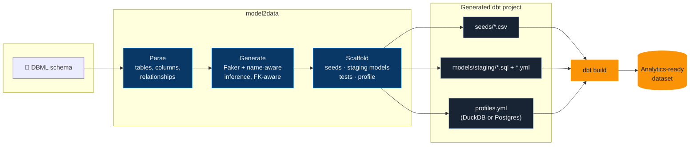

# model2data

[](https://pypi.org/project/model2data/)
[](https://github.com/JB-Analytica/model2data/actions/workflows/ci.yml)
[](https://codecov.io/gh/JB-Analytica/model2data)
[](LICENSE)

**Turn a data model into a running analytics stack in one command.**

Give `model2data` a [DBML](https://dbml.dbdiagram.io/docs/) schema — hand-written or exported
from an existing database — and it generates realistic, relationship-preserving synthetic data
*and* a complete, runnable dbt project around it: seeds, staging models, tests, and a
DuckDB or Postgres profile. No sample data to hunt down, no dbt boilerplate to hand-write, no
production data to risk exposing.

```bash
pip install model2data
model2data --file examples/hackernews.dbml --rows 200 --seed 42
cd dbt_hackernews && dbt build
```

That's a working analytics stack — real (synthetic) data, tested dbt models, queryable in
DuckDB — from a schema file, in seconds:


---

## Why this exists

Analytics engineers hit the same wall constantly: you need realistic data to build or test a
pipeline, but production data is off-limits (privacy, access, scale), and hand-rolling mock CSVs
is tedious and doesn't scale past two tables. `model2data` closes that gap — from a schema
definition to a seeded, tested dbt project you can actually run, with no database or production
access required.

- **Privacy-safe.** Nothing but a schema definition goes in; nothing but synthetic data comes out.
- **Realistic, not random.** Column names are matched against ~35 common patterns — `email`,
  `first_name`, `city`, `phone`, `company`, ... — so a column called `email` gets real-looking
  emails, not `Lorem ipsum` text.
- **Relationship-preserving.** Foreign keys resolve to real parent rows; tables are generated in
  dependency order.
- **Deterministic.** Pass `--seed` and the same schema always produces the same data — safe to
  commit fixtures, safe to diff across CI runs.
- **A real dbt project, not just CSVs.** Seeds, staging models that `ref()` them, schema tests,
  and a ready-to-use profile — the thing you'd otherwise spend an afternoon scaffolding by hand.
  A single `dbt build` loads, transforms, and tests the whole thing.

## Who is model2data for?

- **Analytics engineers** — generate realistic datasets and a working dbt project without
  waiting on production access.
- **Data engineers** — produce deterministic test data from an existing schema for pipeline and
  migration testing.
- **Software & data teams** — prototype integrations and analytics workflows without exposing
  production data.
- **Consultants & architects** — spin up realistic environments for demos, workshops, and
  architecture validation in minutes, not hours.

## How it works



1. **Parse.** Reads tables, columns, types, and `Ref` relationships from a DBML file.
2. **Generate.** Produces synthetic values per column — typed generation for known SQL types
   (int, date, timestamp, ...), name-aware inference for everything else (`email`, `phone`,
   `city`, ...), foreign keys resolved against already-generated parent rows.
3. **Scaffold.** Writes a complete dbt project around that data: CSV seeds, staging models that
   `ref()` those seeds, `not_null`/`unique`/`relationships` tests, `accepted_values` tests for
   DBML `Enum`-typed columns, singular SQL tests for composite primary/unique keys, table and
   column `description:` fields pulled from DBML notes, and a profile for DuckDB (zero-config,
   file-based) or Postgres.

---

## Installation

```bash
pip install model2data
```

---

## Quick start

We provide an example Hacker News dataset in `examples/hackernews.dbml`.

Generate a project with synthetic data:

```bash
model2data --file examples/hackernews.dbml --rows 200 --seed 42
```

This creates a `dbt_hackernews/` folder with your data and dbt setup.

Run dbt to load, transform, and test the data:

```bash
cd dbt_hackernews
dbt build
```

Staging models `ref()` their seeds, so a single `dbt build` loads the seeds, builds the models,
and runs every generated test in one dependency-ordered pass — no separate `dbt seed`/`dbt run`
needed, even on a brand-new database. (The individual `dbt deps`, `dbt seed`, and `dbt run`
commands still work if you'd rather drive the steps yourself; the generated project declares no
packages, so `dbt deps` is a no-op.)

Your analytics-ready dataset is now in DuckDB!

To target Postgres instead, install the extra and pass `--adapter postgres`:

```bash
pip install "model2data[postgres]"
model2data --file examples/hackernews.dbml --rows 200 --seed 42 --adapter postgres
```

Connection details are read from environment variables (`MODEL2DATA_PG_HOST`, `MODEL2DATA_PG_PORT`, `MODEL2DATA_PG_USER`, `MODEL2DATA_PG_PASSWORD`, `MODEL2DATA_PG_DATABASE`), defaulting to `localhost:5432` with a `postgres`/`postgres` user for local development.

After generation, the CLI prints a short summary — tables and rows generated, relationships found in the DBML, and any columns that fell back to generic placeholder text because neither their type nor name could be matched.

Pass `--unit-tests` to also generate deterministic dbt unit test fixtures (`models/staging/ut_stg_<table>.yml`) from the actually-generated seed rows:

```bash
model2data --file examples/hackernews.dbml --rows 200 --seed 42 --unit-tests
```

This targets dbt-core's native unit testing feature, which requires dbt-core >= 1.8 — already
covered by this project's `dbt-core>=1.8.5` floor, so `--unit-tests` works with the base install.
Note: on dbt-core versions in the 1.8.x line specifically, a DBML column named after a SQL
reserved word (e.g. `by`, as in `examples/hackernews.dbml`) can fail unit test execution with a
`syntax error` — a dbt-core-internal identifier-quoting limitation in its unit test fixture
rendering for that release line, not something under model2data's control. It's fixed in later
dbt-core versions; every other `--unit-tests` path works fine on 1.8.x.

---

## Generated dbt project structure

The generated dbt project includes:

```
dbt_{project_name}/
├── seeds/
│   └── raw/
│       ├── __seed_config.yml  # seed descriptions + column-type overrides
│       ├── table1.csv
│       └── table2.csv
├── models/
│   └── staging/
│       ├── stg_table1.sql
│       ├── stg_table1.yml
│       ├── ut_stg_table1.yml  # only with --unit-tests
│       └── ...
├── data-tests/
│   └── unique_combination_stg_table1_col_a_col_b.sql  # only for composite pk/unique keys
├── macros/
│   └── generate_schema_name.sql
├── dbt_project.yml
├── profiles.yml  # DuckDB or Postgres config, depending on --adapter
└── {project_name}_profile.duckdb  # DuckDB adapter only
```

- **Seeds**: CSV files with generated synthetic data, plus `__seed_config.yml` — each seed's
  `description:` (from the table's DBML `Note`) and the column-type overrides that keep
  all-digit text columns (barcodes, zero-padded postcodes, ...) from being loaded as integers.
- **Staging Models**: Basic dbt models that `ref()` their seed. Using `ref()` rather than
  declaring the seeds as dbt `sources` is what gives each model a real DAG edge to the seed
  behind it, so one `dbt build` orders seeds before models on a fresh database.
- **Tests**: A YAML per staging model with column tests (`not_null`, `unique`, `relationships`,
  and `accepted_values` for DBML `Enum`-typed columns). Column `Note` text from the DBML becomes
  `description:` fields.
- **Composite key tests**: Composite primary/unique keys declared in an `indexes { }` block get
  a singular SQL test under `data-tests/`, dbt's configured `test-paths`.
- **Profiles**: Pre-configured for DuckDB (file-based) or Postgres (via env vars), with schema handling.
- **Unit tests** (opt-in via `--unit-tests`): `models/staging/ut_stg_<table>.yml` fixtures built
  from real generated rows, co-located with each staging model so dbt (which only parses unit
  tests from `model-paths`) picks them up. Requires dbt-core >= 1.8.

---

## Using model2data with an LLM

If you want to go from a plain-English description of a data model straight to a running,
demo-ready dbt project, [LLMS.md](LLMS.md) is written for an LLM/agent to read: it covers the
full DBML feature set model2data understands (enums, notes, defaults, composite keys, both
relationship syntaxes, self-references) and the exact command sequence to run. Point an
LLM-backed coding assistant at it and describe your data model — it can author the DBML and run
model2data for you.

---

## Design decisions / non-goals

- **DuckDB Default**: Chosen for its zero-config, file-based nature, making it easy to get started without database setup. Postgres is supported via `--adapter postgres`; other adapters can be configured manually.
- **dbt Integration**: Leverages dbt's transformation capabilities for a familiar workflow in analytics engineering.
- **Synthetic Data**: Uses deterministic generation for reproducibility; not intended for production use or as a replacement for real data.
- **Non-goals**: This is not a data migration tool, ETL pipeline, or real-time data generator. It focuses on static, synthetic datasets for testing and prototyping.

---

## Limitations

- Synthetic data generation is heuristic-based (typed generation, name-aware inference, enum/default awareness) and may not perfectly mimic real-world distributions or edge cases.
- DuckDB and Postgres are supported today; other databases require manual profile adjustments.
- No support for incremental models or advanced dbt features in generated projects.
- Composite foreign keys (across a bridge/join table) are generated as independent single-column FKs — each column's values are individually valid, but the *combination* isn't guaranteed to match a real parent composite key unless that key is separately enforced via `indexes { }`.
- Any DBML the parser can't fully make sense of (a malformed line, a ref pointing at an unknown table, an unrecognized column definition) is reported as a warning in the CLI's summary rather than silently dropped — check that summary after generating from a schema you didn't author yourself.

---

## Project status

As of `1.0.0`, model2data is considered **feature-complete for its intended use case**: turning a
DBML schema into realistic synthetic data and a runnable dbt project, reliably. There's no active
roadmap of new capabilities planned — the focus from here is maintenance: bug fixes, keeping pace
with new dbt-core releases, and reviewing community contributions.

Ideas that came up during development but were deliberately left out of scope, in case anyone
wants to pick them up as a contribution:

- Additional database adapters (e.g. Snowflake, BigQuery).
- A rule-based semantic layer scaffold (`semantic_models.yml`/basic metrics) derived from the
  parsed schema shape.
- Example mart-layer models on top of staging (the generated `dbt_project.yml` carries a
  ready-to-uncomment `marts` schema/materialization config for this).
- Locale-aware generation (`--locale`) for non-English/US synthetic data.

See [CONTRIBUTING.md](CONTRIBUTING.md) if you'd like to work on any of these.

---

## Contributing

We welcome contributions!

- Open issues for bugs or feature requests.
- Submit PRs to add new DBML examples, custom data generators, or improvements.
- Ensure all new features include tests if possible.

See [CONTRIBUTING.md](CONTRIBUTING.md) for detailed guidelines, and [DEVELOPMENT.md](DEVELOPMENT.md) for the local dev setup and release process.

## Code of Conduct

Please read our [Code of Conduct](CODE_OF_CONDUCT.md) to understand our community standards.

---

## License

MIT License. See LICENSE for details.

---

<p align="center">
  <a href="https://www.jbanalytica.com">
    
  </a>
  <br>
  Built and maintained by <a href="https://www.jbanalytica.com"><strong>JB Analytica</strong></a> —
  Data & Analytics Engineering · Data Platform Architecture · Modern BI.
</p>
